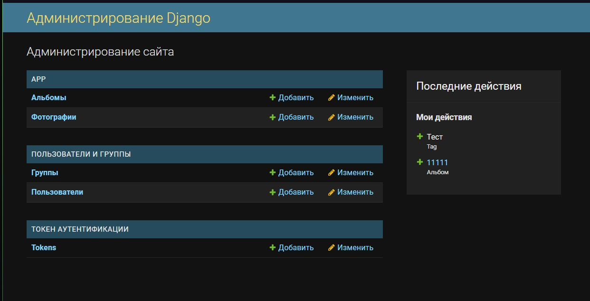
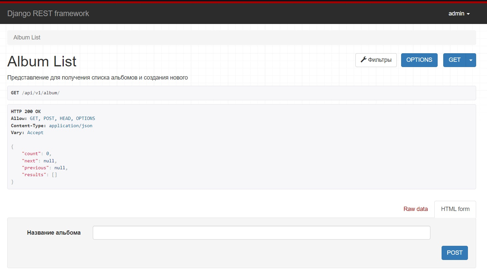
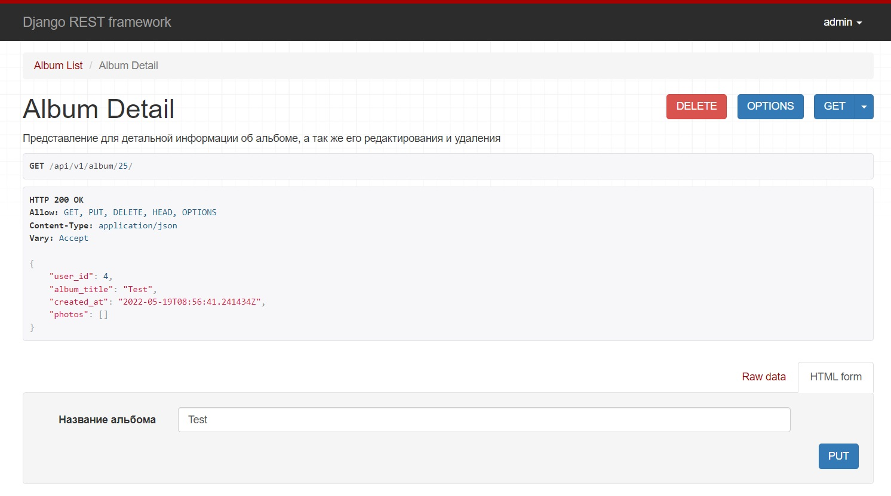
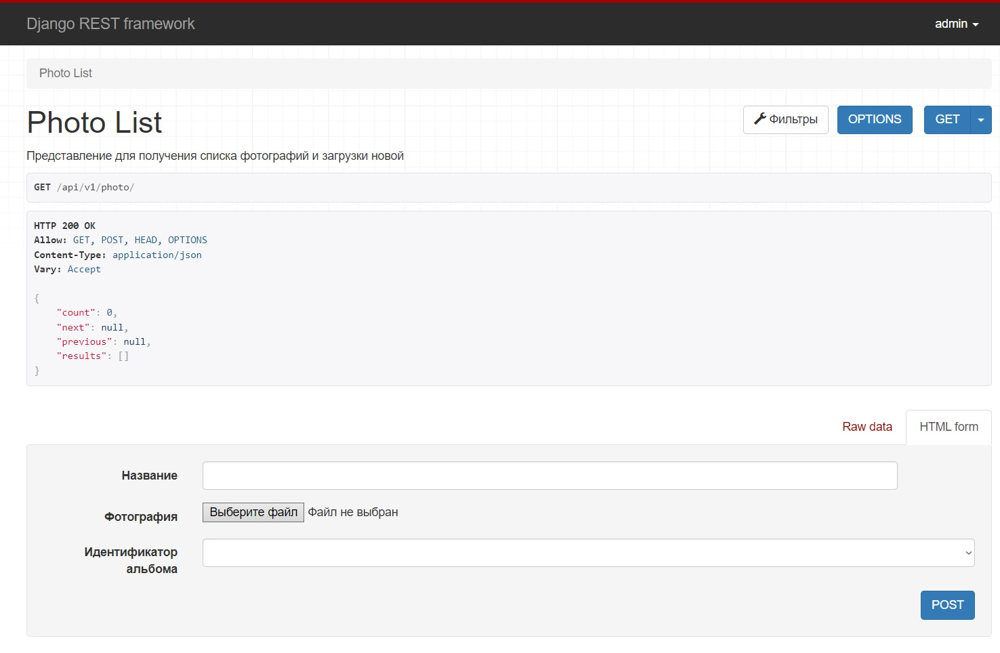
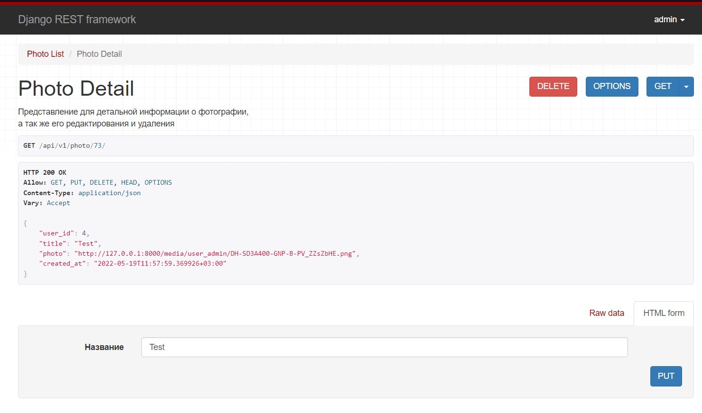
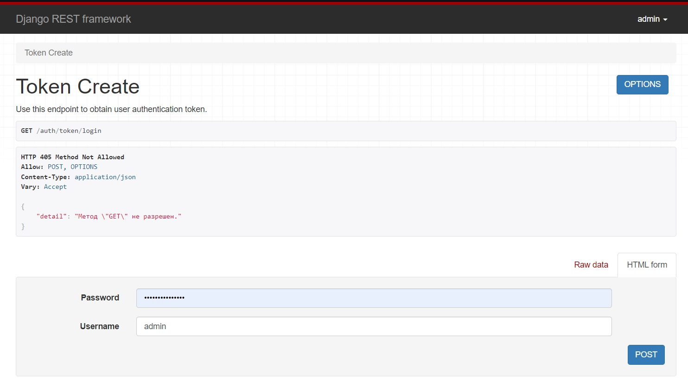
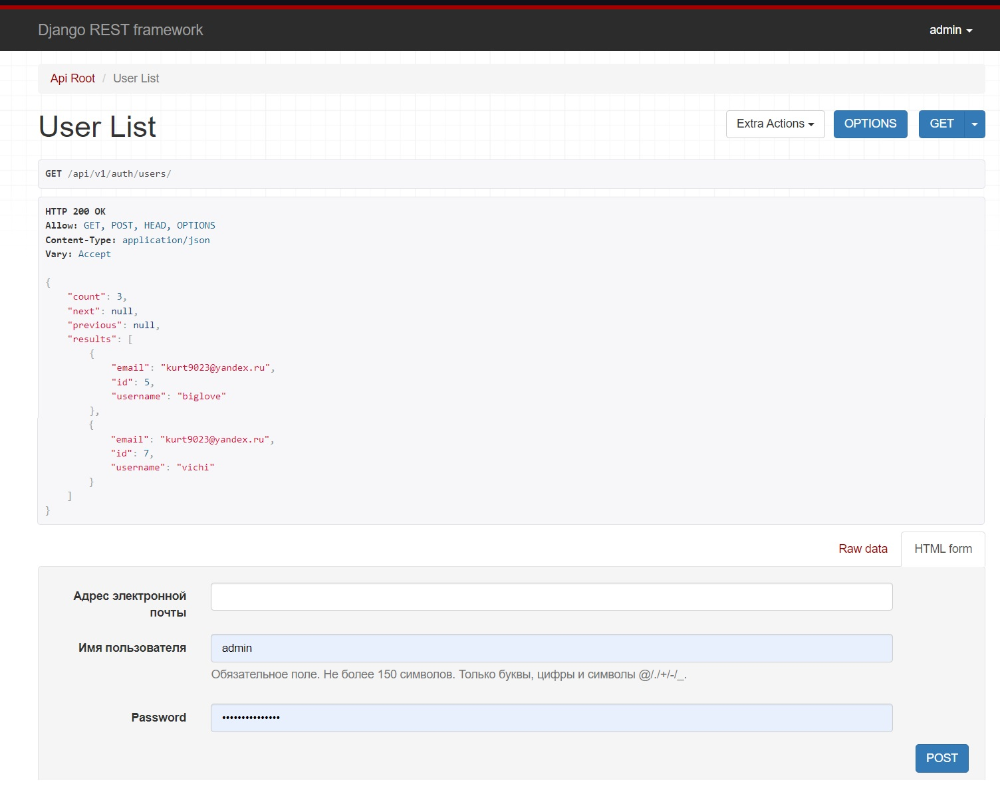
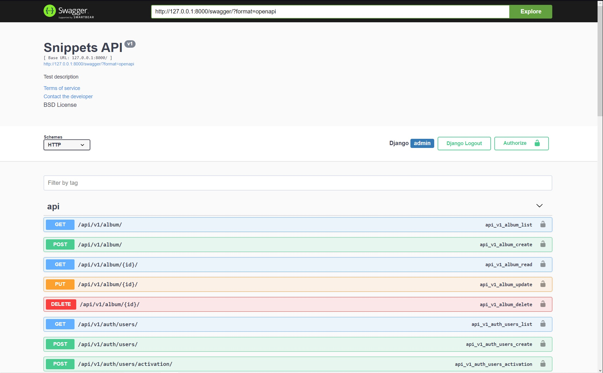

<h1 align="left">PhotoAlbum</h1>

## Описание

**Как это работает**

<ul>
    <li>admin/ - панель администратора</li>
    <li>api/v1/photo/ - список фотографий</li>
    <li>api/v1/photo/pk/ - страница конкретной фотографии, где pk=id фотографии</li>
    <li>api/v1/album/ - список альбомов</li>
    <li>api/v1/album/pk/ - страница конкретного альбома, где pk=id альбома</li>
    <li>api/v1/auth/users - страница со списком пользователей</li>
    <li>api/v1/drf-auth/ - окно логина</li>
    <li>auth/token/login/ - форма получения токена</li>
    <li>auth/token/logout/ - фотма обнуления токена</li>
    <li>swagger - DFR документация</li>
</ul>

Панель администратора.

Страница со списком альбомов. Необходимо заполнить поля и нажать "POST".

В данном разделе доступны методы "Удалить" и "Изменить".

Страница со списком фотографий. Необходимо заполнить поля и нажать "POST".

В данном разделе доступны методы "Удалить" и "Изменить".

В данном разделе можно получить Ваш токен.

В данном разделе можно получить информацию о зарегистрированных пользователях, а так же создать нового.

Страница DRF документации.

## Support

По любым вопросам обращайтесь ко мне любым удобным для Вас способом!
<ul>
    <li>Эл. почта: biglov.evgen@gmail.com</li>
    <li>Телефон: +7 (938) 416-66-72</li>
</ul>

